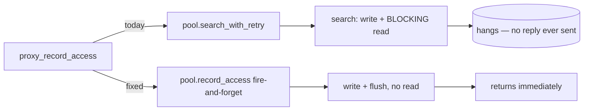

# feat: Root containment, record_access hang fix, and per-root ignore config

**Created:** 2026-06-11
**Type:** feat (Track A + Track C) / fix (Track B)
**Depth:** Deep
**Target repo:** fff (this repo)

---

## Summary

Three related changes to the fff master/worker engine:

- **Track A — Root containment.** Make a registered root authoritatively serve its entire subtree. When a handshake or `Connect` arrives for a path that lives under an already-registered root, route it to that root's existing worker and bind it to that root's `EngineState` instead of minting a new slug + index + frecency DB + watcher. A background task subsumes any *already-existing* redundant child roots. Result: one index/watcher/frecency DB per logical project, not one per directory a client happened to land in.
- **Track B — `record_access` hang fix.** `record_access` is semantically fire-and-forget but is dispatched through the blocking request/response pool path, so the MCP client blocks forever on a reply the engine never sends. Dispatch it as true fire-and-forget and add a read timeout to the master-mode worker connection as a safety net.
- **Track C — Per-root ignore config.** Let each configured root declare gitignore-style ignore patterns in `config.toml`, applied to both the indexing walk and the background watcher.

MCP (Model Context Protocol), LMDB (Lightning Memory-Mapped Database), IPC (Inter-Process Communication), TTL (Time To Live), LRU (Least Recently Used).

---

## Problem Frame

Each registered root is keyed by `slug = blake3(canonical base_path)` (`crates/fff-ipc/src/paths.rs`). That slug is the isolation boundary for the per-root socket, lockfile, log, LMDB frecency DB (`crates/fff-engine/src/state.rs`), in-memory `FilePicker` index, and filesystem watcher. The master dedups roots **only by exact slug** — `entry.contains_slug(&slug)` in `assign_new_root` and the `Handshake` routing hit (`crates/fff-engine/src/master.rs`). There is no notion that one root contains another.

Because `fff-mcp` resolves its default root non-deterministically from wherever it launches (git-toplevel snap for git repos, raw cwd otherwise — `crates/fff-mcp/src/main.rs`), and because explicitly-registered roots are stored verbatim, nested roots like `Surge`, `Surge/30. Architecture`, and `Surge/30. Architecture/ADR` each spin up an independent index, watcher, and frecency DB over the same files — triple-indexing, triple-watching, and fragmenting frecency signal across three databases.

Separately, `record_access` (`crates/fff-mcp/src/server.rs` `proxy_record_access`) dispatches a `RecordAccess` request via `pool.search_with_retry` → `EngineClient::search`, which always blocks on `read_message_sync`. But the engine handles `RecordAccess` as fire-and-forget and writes **no response** (`crates/fff-engine/src/worker.rs`, `crates/fff-engine/src/server.rs`). The master-mode `connect()` sets no read timeout (unlike `connect_legacy` / `check_health`), so the read blocks indefinitely and hangs the calling agent.

Finally, users have no way to exclude specific sub-directories from a root's index beyond `.gitignore`; the ignore lists are compile-time constants applied only in the non-git branch (`crates/fff-core/src/ignore.rs`).

---

## Requirements

- **R1** — A handshake/`Connect` for a path strictly under an existing registered root resolves to that root's worker and `EngineState`; no new slug/index/watcher/frecency DB is created for the sub-path.
- **R2** — Containment uses canonicalized, path-component longest-prefix matching. Empty / `<unknown>` stored base_paths are skipped. `/foo/bar` must not be treated as containing `/foo/barbaz`.
- **R3** — When a root is registered that contains one or more existing child roots, those children are subsumed (frecency merged into the parent, then evicted) by a background task that never blocks the handshake hot path.
- **R4** — Whole-root result semantics: a contained sub-path query returns results across the entire containing root, consistent with today's git-toplevel-snap behavior. No subtree scoping.
- **R5** — `record_access` returns promptly and never blocks the MCP client on an engine reply.
- **R6** — The master-mode worker connection has a bounded read timeout so no fire-and-forget or slow-reply path can hang the client indefinitely.
- **R7** — Each configured root may declare gitignore-style ignore patterns in `config.toml`; matching paths are excluded from both the index walk and the background watcher.
- **R8** — No top-level Rust/Lua/C/bun API breaks. No reordering of existing bincode enum variants. (AGENTS.md hard constraint.)

---

## High-Level Technical Design

### Containment resolution (Track A)

```mermaid
sequenceDiagram
    participant C as fff-mcp client
    participant M as master
    participant W as worker (holds ancestor root)

    C->>M: Handshake{ base_path = /Surge/30. Architecture/ADR }
    Note over M: 1. exact-slug hit? no<br/>2. longest-prefix match vs<br/>routing.json base_paths → /Surge
    M-->>C: WorkerSocket{ path, worker_index = ancestor's }
    Note over M: child slug NOT pushed;<br/>schedule async subsumption sweep
    C->>W: Connect{ base_path = /Surge/30. Architecture/ADR }
    Note over W: get_or_init: no exact slug,<br/>but a loaded root (/Surge) is an ancestor<br/>→ bind connection to /Surge EngineState
    W-->>C: Ack
    C->>W: Grep/FindFiles/RecordAccess … (served by /Surge index + frecency)
```

Two cooperating changes are required because routing alone is insufficient — the worker's `Connect{child}` would otherwise re-mint a child `EngineState`:

1. **Master** resolves the worker by longest-prefix match (so the child is routed to the *ancestor's* worker) and does not register a child slug.
2. **Worker** `get_or_init` resolves a `Connect` for a sub-path to an already-loaded ancestor `EngineState`.

No new IPC variant: the master already stores canonical `base_path` per `RootEntry` in `routing.json`, and the worker holds each `EngineState`'s `base_path`. Whole-root semantics mean the connection simply binds to the ancestor state; nothing downstream needs the original sub-path.

### record_access dispatch (Track B)



---

## Key Technical Decisions

- **KTD1 — Longest-prefix containment at both master and worker, no new wire field.** Reuse the canonical `base_path` already in `routing.json` (master) and `EngineState.base_path` (worker). Avoids appending a field to `MasterResponse::WorkerSocket` and the client path-equality validation churn that would follow. *(see research: master already stores per-slug canonical base_path)*
- **KTD2 — Pure path-component longest-prefix, not `.git`-aware** *(user decision)*. Boundary matching via `Path::starts_with` semantics on canonicalized paths (mirror `crates/fff-mcp/src/registry.rs` `root_for_path`). Skip empty/`<unknown>` base_paths (legacy-migration guard). Nested repos/submodules under a parent are absorbed into the parent index; users can carve them back out with Track C ignore patterns, and the existing git-toplevel snap already groups by repo.
- **KTD3 — Subsumption is async/background, never on the hot path** *(user decision)*. When the master registers a root that contains existing children, it schedules a background task (off the handshake path) that, per contained child: merges the child frecency DB into the parent via a new `FrecencyTracker` method (keys are `blake3(absolute_path)` and identical across roots, so a straight key-union with timestamp dedup + the existing 128-cap / 30-day invariants), then evicts the child root. The handshake itself returns immediately.
- **KTD4 — `record_access` stays on the pool but dispatches fire-and-forget.** Keep pool routing/recovery consistency (longest-prefix root resolution still applies) but use a write-and-flush-only path with no blocking read — mirroring how the engine already treats worker→master `EvictedRoot`. `EngineClient::record_access` already implements the fire-and-forget primitive; the pool needs a thin pass-through.
- **KTD5 — Read timeout on master-mode `connect()`.** Add `SO_RCVTIMEO`-style read deadline on the worker stream in `EngineClient::connect`, matching the 5s used by `connect_legacy` / `check_health`. Defense-in-depth so any future no-reply/slow-reply path degrades to a logged warning, not a hang.
- **KTD6 — Per-root ignore lives on `McpRoot`, resolved at worker `state::init` by canonical-path match.** The worker already loads the full `FffConfig`; at `state::init` for a base_path it matches against `config.mcp.roots` (canonicalized, longest-prefix — same identity discipline as `name_for_path`) and feeds the root's gitignore-style patterns into `FilePickerOptions`. Avoids a `Connect` wire change. Patterns are applied via `ignore::overrides::OverrideBuilder` in **both** the git and non-git walk branches and honored by the background watcher.
- **KTD7 — Gitignore-syntax patterns** *(user request)*. The ignore field is `Vec<String>` of gitignore-style globs (`target/`, `**/*.log`, `!keep/`), passed verbatim to `OverrideBuilder`. No bespoke matcher.

---

## Scope Boundaries

### In scope
- Containment routing (master + worker), async subsumption with frecency merge, the record_access fix + connect timeout, and per-root gitignore-style ignore config end-to-end (config → worker → walk + watcher).

### Deferred to Follow-Up Work
- A **global** default ignore list in `IndexConfig` (Track C is per-root only for now).
- `.git`-boundary-aware containment (explicitly rejected for v1 per KTD2; revisit only if absorbed-nested-repo reports arrive).
- Subtree-scoped query results (explicitly out per R4).
- `fffctl` surfacing of containment relationships (which roots are subsumed under which) — diagnostics only, not required for correctness.

### Out of scope
- Changing the slug derivation, the IPC framing, or the two-phase handshake protocol shape.

---

## Implementation Units

### U1. Master-side ancestor-aware routing

**Goal:** Route a handshake for a sub-path to the containing root's worker without registering a new slug.
**Requirements:** R1, R2, R4, R8
**Dependencies:** none
**Files:**
- `crates/fff-engine/src/master.rs` (Handshake routing hit ~685-720, `assign_new_root` ~280-342)
- `crates/fff-ipc/src/routing.rs` (read `RootEntry.base_path`; possibly a helper to find a containing root)
- `crates/fff-engine/tests/integration.rs`
**Approach:** Before the exact-slug paths, add a longest-prefix lookup over all `WorkerEntry.roots` comparing canonicalized incoming base_path against stored `RootEntry.base_path` via path-component `starts_with`. Skip empty/`<unknown>` base_paths. On a containment hit, return that root's `worker_index` and do **not** `push_root` the child slug. Keep the exact-slug fast path first (cheapest). Containment check is read-only over the routing table; do not extend any lock hold across I/O (canonicalize the incoming path before taking the routing lock, as `assign_new_root` already does).
**Patterns to follow:** `crates/fff-mcp/src/registry.rs` `root_for_path` (longest-prefix algorithm, component-boundary correctness); existing canonicalize-before-lock ordering in `assign_new_root`.
**Test scenarios:**
- Handshake for an exact registered root → returns that root's worker (unchanged behavior).
- Handshake for a strict sub-path of a registered root → returns the ancestor's worker; routing table gains no new slug. Covers R1.
- `/foo/bar` registered, handshake for `/foo/barbaz` → NOT contained; mints its own root. Covers R2 boundary correctness.
- Two registered roots where one is an ancestor of the other → deeper path resolves to the longest (most specific) containing prefix.
- Routing entry with empty/`<unknown>` base_path present → skipped, no panic, falls through to normal assignment. Covers R2.
- Handshake for an unrelated path → normal `assign_new_root`, new slug (unchanged).
**Verification:** Integration test asserts routing-table slug count stays constant across a parent + N sub-path handshakes; sub-path handshakes return the parent's worker_index.

### U2. Worker-side ancestor resolution in `get_or_init`

**Goal:** A `Connect` for a sub-path binds to an already-loaded ancestor `EngineState` instead of minting a child one.
**Requirements:** R1, R4, R8
**Dependencies:** U1
**Files:**
- `crates/fff-engine/src/worker.rs` (`get_or_init` ~69-132, the `roots` map)
**Approach:** In `get_or_init(base_path)`, after the exact-slug miss and before creating a new `EngineState`, scan the loaded `roots` for an entry whose `state.base_path` is an ancestor of the requested path (canonicalized, longest-prefix). On hit, update its `last_access_ms` and return that `Arc<EngineState>` — binding the connection to it. Preserve the per-slug `init_gates` discipline and the read-lock-fast-path / write-lock-slow-path structure; the ancestor scan runs under the existing read lock, no new lock held across `.await`/`spawn_blocking`.
**Patterns to follow:** existing `get_or_init` lock choreography; `evict_lru`'s `roots` iteration.
**Test scenarios:**
- Worker holds root `/a`; `Connect{/a/b/c}` → returns the `/a` `EngineState`, no new map entry. Covers R1.
- Worker holds root `/a`; `Connect{/a}` → exact hit, unchanged.
- Worker holds `/a` and `/a/b` (transient overlap before subsumption); `Connect{/a/b/c}` → binds to the longest match `/a/b`.
- Worker holds no ancestor of the requested path → mints a new `EngineState` (unchanged).
- Concurrent `Connect{/a/b/c}` and `Connect{/a/b/d}` while `/a` is loaded → both bind to `/a`, no duplicate init, no init-gate deadlock.
**Verification:** With U1, a parent + sub-path client session shares one `EngineState` (assert via worker Health that root count does not grow for sub-path connects).

### U3. Async subsumption of pre-existing child roots

**Goal:** When a root containing existing children is registered, merge their frecency into the parent and evict them, off the hot path.
**Requirements:** R3
**Dependencies:** U1, U4-frecency-merge (the new `FrecencyTracker` method below lives here)
**Files:**
- `crates/fff-engine/src/master.rs` (spawn background task from the Handshake/assign path; reuse `handle_evicted_root` / `stop_worker` plumbing)
- `crates/fff-core/src/dbs/frecency.rs` (new `merge_from` method)
- `crates/fff-engine/src/state.rs` (resolve child + parent frecency DB paths for the merge)
- `crates/fff-core/src/dbs/frecency.rs` unit tests
**Approach:** When U1 detects that a *newly registered* root contains one or more *existing* registered roots, schedule a `tokio::spawn` background task (do not block the handshake response). The task, per contained child: opens both frecency DBs, calls `parent.merge_from(&child)` (read-all child entries with a read txn, union each `VecDeque<u64>` into the parent under a write txn, dedup + sort timestamps, re-apply `MAX_TIMESTAMPS_PER_FILE` cap and 30-day cutoff — same invariants as `track_access` / `purge_stale_entries`), then triggers eviction of the child root (route the child slug through the existing `EvictedRoot` / `handle_evicted_root` path). Keys are `blake3(absolute_path)` and identical across roots, so no path rewriting. Hold no lock across the merge I/O or `.await`.
**Patterns to follow:** `purge_stale_entries` (read-all-then-write-batch template), `handle_evicted_root` + `stop_worker` (eviction), the cold-start "read atomic under brief lock, drop before await" idiom.
**Execution note:** Add the `merge_from` unit test first — it is the load-bearing, pure-logic piece and is cheap to characterize before wiring the background task.
**Test scenarios:**
- `merge_from`: parent has timestamps for file X, child has different timestamps for X → merged entry is the deduped, sorted union, capped at 128 and within 30 days. (unit)
- `merge_from`: child has a file the parent never saw → key appears in parent post-merge. (unit)
- `merge_from`: child entry exceeds cap after union → oldest timestamps dropped to 128. (unit)
- `merge_from` on an empty child DB → parent unchanged, no error. (unit)
- Integration: register `/a`, then register parent `/` (or query `/a/b` first so `/a/b` exists, then register `/a`) → background task eventually evicts the child slug and the parent retains merged frecency; handshake that triggered it returned without waiting. Covers R3.
- Subsumption failure (child DB unreadable) → logged warning, parent untouched, no panic, child still aged out by idle-TTL.
**Verification:** After registering a containing root over an existing child, the child slug disappears from routing within the background task's completion; parent frecency for a file accessed under the child is non-empty.

### U4. Fire-and-forget `record_access` dispatch

**Goal:** `record_access` returns promptly without blocking on a non-existent engine reply.
**Requirements:** R5
**Dependencies:** none
**Files:**
- `crates/fff-mcp/src/pool.rs` (new fire-and-forget pass-through, e.g. `record_access(base_path, path)`)
- `crates/fff-mcp/src/server.rs` (`proxy_record_access` ~699-713 → use the new pass-through)
- `crates/fff-mcp/src/pool.rs` unit tests
**Approach:** Add a pool method that resolves/obtains the cached `EngineClient` for the (longest-prefix-resolved) base_path and calls the existing fire-and-forget `EngineClient::record_access` (write + flush, no read). Preserve the longest-prefix root resolution `proxy_record_access` already does via `registry.root_for_path`. On connection error, best-effort: drop the cached client (so the next real request reconnects) and return — do not block on recovery. `proxy_record_access` returns `ok` immediately.
**Patterns to follow:** existing `EngineClient::record_access` (`crates/fff-mcp/src/client.rs`); `EvictedRoot` fire-and-forget direction on the engine side.
**Test scenarios:**
- `record_access` with a connected pool client → write is issued, call returns without reading a frame. Covers R5.
- `record_access` when no client is cached → connects (bounded by U5 timeout), writes, returns; does not hang.
- `record_access` on a dead/stale connection → invalidates the cache entry, returns promptly; next search reconnects.
- Worker actually records the access (integration): frecency for the path is updated, observable via a subsequent `list_recent_files`.
**Verification:** A `record_access` call completes in well under a second against a live engine and never blocks; worker frecency reflects the access.

### U5. Read timeout on master-mode `connect()`

**Goal:** Bound the worker-socket read so no reply-less or slow path hangs the client.
**Requirements:** R6
**Dependencies:** none
**Files:**
- `crates/fff-mcp/src/client.rs` (`connect` ~32-67)
**Approach:** Set read (and confirm write) timeout on the worker `UnixStream` in `connect`, matching the 5s used in `connect_legacy` (`client.rs:102-103`) and `check_health` (`client.rs:178-179`). Ensure the Phase-2 `Connect`/`Ack` read still succeeds within the deadline for normal cold-start (cold-start readiness is gated server-side; confirm the timeout is generous enough or that the Ack is sent before the scan completes). A timed-out read surfaces as a normal connection error routed through existing recovery, not a panic.
**Patterns to follow:** `connect_legacy` / `check_health` timeout setup.
**Test scenarios:**
- Normal connect + `Connect`/`Ack` round-trip completes within the timeout (unchanged behavior).
- A worker that never replies → read times out within the deadline and returns an error instead of hanging. Covers R6.
- Timeout error is classified as a connection error so `search_with_retry` recovery still triggers once.
**Verification:** Simulated non-responsive worker causes `connect`/`search` to return an error within ~5s rather than blocking indefinitely.

### U6. Per-root ignore field in config

**Goal:** Let a configured root declare gitignore-style ignore patterns.
**Requirements:** R7, R8
**Dependencies:** none
**Files:**
- `crates/fff-ipc/src/config.rs` (`McpRoot` ~55-60; add `#[serde(default)] ignore: Vec<String>`)
- `crates/fff-ipc/src/config.rs` unit tests
- `README.md` (document the new key)
**Approach:** Add `ignore: Vec<String>` to `McpRoot`, defaulting to empty, parsed from `config.toml`. Keep `FffConfig` lenient (no `deny_unknown_fields`) so older binaries tolerate it. Patterns are gitignore-syntax strings, validated only for non-emptiness of individual entries (the `ignore` crate reports bad globs at build time — surface those as warnings, not hard failures, consistent with `non_git_repo_overrides`).
**Patterns to follow:** existing `McpRoot` / `McpConfig` shape and `#[serde(default)]` usage; `config.rs` `load_from` error handling.
**Test scenarios:**
- `config.toml` with a root declaring `ignore = ["target/", "**/*.log"]` parses into `McpRoot.ignore`. Covers R7.
- Root with no `ignore` key → empty vec (default), no error. Covers R8 (back-compat).
- Malformed TOML for the field → `load_from` error (explicit-path) / warn-and-default (`load`), consistent with existing behavior.
**Verification:** Round-trip parse test; README documents the key with a gitignore-syntax example.

### U7. Apply per-root ignore patterns in walk + watcher

**Goal:** Honor a root's ignore patterns during indexing and watching.
**Requirements:** R7
**Dependencies:** U6
**Files:**
- `crates/fff-engine/src/state.rs` (`init` / `EffectiveArgs`: resolve matching `McpRoot.ignore` for the base_path by canonical longest-prefix match against `config.mcp.roots`)
- `crates/fff-core/src/file_picker.rs` (`FilePickerOptions` ~395-416: new ignore-patterns field; `WalkBuilder` ~1808-1821: apply an `OverrideBuilder` in **both** git and non-git branches)
- `crates/fff-core/src/ignore.rs` (helper to build an `Override` from user patterns, reusing the `OverrideBuilder` approach of `non_git_repo_overrides`)
- `crates/fff-core/src/background_watcher.rs` (honor the same patterns when filtering watch events)
- `crates/fff-core/src/file_picker.rs` unit tests
**Approach:** At `state::init`, resolve the ignore patterns for this root (canonical-path match against `config.mcp.roots`, same identity discipline that fixed the `name_for_path` bug). Thread them through `EffectiveArgs` → `FilePickerOptions` → an `ignore::overrides::Override` applied to `WalkBuilder.overrides(...)`. Today `overrides` is only called in the non-git branch; apply user overrides in both branches so ignores work inside git repos too. The background watcher must consult the same `Override` so ignored paths don't get re-added on filesystem events (avoid the write-but-never-read silent no-op, and the watcher-fd waste). Trace the field end-to-end per the CLAUDE.md "new identifier consumed at every layer" rule.
**Patterns to follow:** `non_git_repo_overrides` (`OverrideBuilder` from glob patterns); existing `FilePickerOptions` field plumbing; background watcher's existing gitignore filtering.
**Test scenarios:**
- Root with `ignore = ["secret/"]` in a **git** repo → files under `secret/` absent from index results. Covers R7 (git branch, the new code path).
- Same in a non-git directory → excluded (extends existing non-git override behavior).
- Negation pattern (`!keep/` after a broader ignore) behaves per gitignore semantics. Covers R7 + KTD7.
- Empty ignore list → walk behavior identical to today (regression guard).
- A newly created file under an ignored dir → watcher does not add it to the index. Covers R7 (watcher layer).
- Base_path not matching any `McpRoot` (e.g. on-demand root not in config) → empty ignore set, no error.
**Verification:** Index a fixture tree with an ignored sub-dir under git; assert ignored files never appear in `find_files`/`grep` and are not re-added on touch.

---

## System-Wide Impact

- **Affected parties:** MCP-driven agents (no longer hang on `record_access`; sub-path sessions now share a parent index and compounding frecency). Neovim UI is unaffected — these are engine/MCP-layer changes.
- **Behavioral shift:** Launching `fff-mcp` in a sub-directory of an existing root now searches the whole containing root. This matches existing git-repo behavior and is the intended R4 semantics, but is a visible change for any non-git nested-root setups.
- **Frecency:** Signal compounds into the containing root rather than fragmenting; subsumption merges historical signal forward.
- **Release:** User-visible (bugfix + config addition). Per release process, bump via `cargo set-version --workspace`; verify `HOMEBREW_TAP_TOKEN` is set on the tap repo before tagging. Build/test locally with `--no-default-features` to avoid the Zig dependency.

---

## Risks & Dependencies

- **Lock discipline (high-attention).** U1/U2/U3 touch the master routing lock, the worker `roots` RwLock, and frecency write txns. AGENTS.md mandates no long mutex/rwlock holds and confirming with the human on risky locking. All new scans run under existing brief read locks; all I/O (canonicalize, merge, spawn) happens outside locks. The async subsumption task must not hold the routing lock across the frecency merge.
- **Bincode variant ordering (R8).** No new `MasterRequest`/`MasterResponse`/`SearchRequest` variants are introduced by this plan (containment reuses stored base_paths). If implementation reveals a variant is unavoidable, it must be appended last per the `types.rs` contract.
- **Cold-start vs read timeout (U5).** The new read timeout must not trip during a legitimate cold-start `Connect`/`Ack`. Confirm the server sends `Ack` before/independent of the full background scan (cold-start readiness is gated at query time, not Connect time — verify during implementation).
- **Subsumption races.** A child being actively queried while subsumption runs: eviction must respect the existing "no eviction with live connections" guard (`Arc::strong_count`); if the child is busy, defer — idle-TTL remains the backstop.
- **Ignore identity bug (U7).** Per-root ignore must match the *canonicalized* base_path the worker indexes, not the raw config string (the `name_for_path` lesson), or ignores silently no-op.

---

## Sources & Research

- Repo research: master routing (`master.rs:280,685`), routing types (`routing.rs:16`), pool/client (`pool.rs:18,52`, `client.rs:32,223`), frecency (`dbs/frecency.rs:104,226,247,124`; `state.rs:85`), worker lifecycle (`worker.rs:46,69,168`), walk/ignore (`file_picker.rs:1808,395`; `ignore.rs:41`), config (`config.rs:31,46,143`).
- Prior learnings: RootEntry refactor (`docs/plans/2026-06-09-root-entry-refactor.md`), master recovery fix (`docs/plans/2026-06-10-004-fix-master-recovery-plan.md`), multi-root MCP (`docs/plans/2026-06-10-001-feat-multi-root-fff-mcp-plan.md`), unified config (`docs/plans/2026-06-10-003-feat-unified-mcp-config-plan.md`), cold-start readiness (`docs/plans/2026-06-10-009-fix-coldstart-grep-readiness.md`).
- No external research: internal architecture with strong local patterns; the `ignore` crate is already a project dependency.
